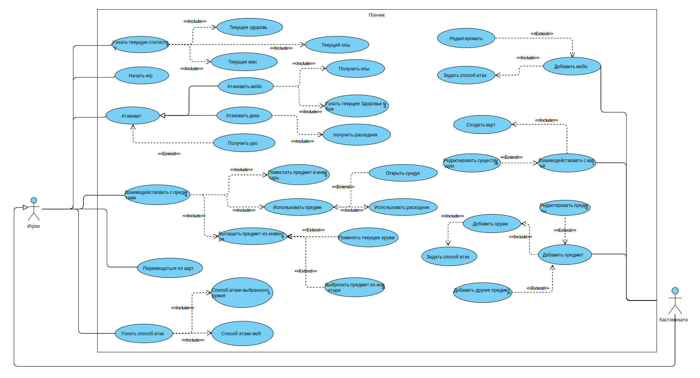
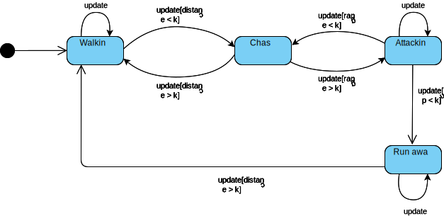

# Как запустить? 
В проекте используется cocos2d, который уже встроен в репозиторий, и GoogleTests. GoogleTests загружаются с помощью Cmake.
***
Для сборки необходимо скачать необходимые зависимости
#### Linux
```shell
    sudo apt-get install build-essential libgtk-3-dev
    sudo apt install libglew-dev
    sudo apt-get install curl
    sudo apt-get install libssl-dev libcurl4-openssl-dev
    sudo apt-get install libgl1-mesa-dev xorg-dev
```
#### Windows
```shell
  choco install ninja cmake
```

### Cборка

При сборке используется cmake и тип сборки Release:

#### Windows
```shell
  cmake -B ./build -AWin32 -DCMAKE_BUILD_TYPE=Release
  cmake --build ./build --config Release
```

#### Linux
```shell
  cmake -B ./build -DCMAKE_BUILD_TYPE=Release
  cmake --build ./build --config Release
```

Сам запуск:

```shell
    to do
```
### Тестирование
Запуск тестов в директории tests/test_*

# Архитектурная документация
***
## Служебная информация

**Название:** Пончик\
**Авторы:** Арефьев Владислав, Асадуллин Илья, Самсонов Павел\
**Дата:** 14.06.2023

***

## 1. Общие сведения о системе
Система является однопользовательской пошаговой игрой с тайловой гарфиков в жанре roguelike с видом сверху и генерацией мира.

#### Описание границ системы
+ Система является игрой
+ Жанр игры roguelike
+ Игра является однопользовательской, пользователи не могут взаимодействовать друг с другом
+ Игра является десктопной
+ Игра является пошаговой, т.е. все механизмы срабатывают во время хода игрока
+ Взаимодействие с интерфейсом игры происходит исключительно с помощью клавиатуры и мыши
+ Внутриигровой мир двумерный
+ Игра использует тайловую графику
+ Система не использует звуковое сопровождение
+ Внутриигровая система не использует технологии искусственного интеллекта, 
вместо него используется генератор целых псевдо-случайных чисел
+ Внутриигровые карты могут создаваться из любого тайлсета
+ Система при работе не использует сеть

#### Описание контекста
+ Использует клавиатуру и мышь
+ Работает только на таких операционных системах, как Windows и Linux

***
## 2. Architectural drivers

#### Технические ограничения
+ Операционные системы: Windows и Ubuntu
#### Бизнес-ограничения
+ Разработка системы должна завершиться как можно раньше, а зачтена к 25.06.23.
+ Используемый бюджет должен составлять 0 рублей.  

#### Качественные характеристики системы
+ Система должна быть расширяемой, архитектура должна позволять быстро внедрять новые механики
+ Игровой процесс должен быть легко кастомизирован
+ Система должна быть выскопроизводительной, чтобы каждый шаг занимал не более 1 секунды 
на компьютере с процессором Intel Core i3
+ Объем используемой оперативной памяти системой не должен превышать 1 ГБ.

#### Ключевые функциональные требования
+ Система должна предоставлять графический пользовательский интерфейс с тайловой графикой.
+ Персонаж игрока, должен перемещаться по карте и управляться с помощью клавиатуры и мыши.
+ Персонаж должен иметь характеристики: здоровье, мана, опыт.
+ Игровой мир должен генерироваться.
+ В игре должны присутствовать оружие и расходники (зелья здоровья и маны).
+ Персонаж должен иметь инвентарь, в котором может храниться любой предмет в игре.
+ В игре должны присутствовать существа (мобы), с которыми игрок может вступать в бой.
+ При убийстве моба игрок должен получать очки опыта.
+ Перемещение и атака персонажа определяет единицу времени в игровом мире
+ Система должна оповещать о получении урона
+ В игровом мире должны присутствовать элементы декора

#### Нефункциональные требования
+ Персонаж должен перемещаться с помощью стрелочек, атака производиться через пробел, а взаимодействие с предметами 
происходит с помощью клавиши E и мыши.

***
## 3. Роли и случаи использования

### Диаграма случаев использования


#### Роли:
+ Игрок
+ Кастомизатор 

Ниже представлены случаи использования для каждой из ролей.
#### Случаи использования:
Игрок может: 
- начать игру
- перемещаться по карте
- узнать текущую статистику, состоящую из очков здоровья, маны и опыта
- атаковать мобов для получения опыта и декорация для получения расходников
- поднимать предметы из мира
- перемещать предметы по инвентарю и активировать их
- узнать способ атаки используемого оружия и моба

Кастомизатор расширяет роль игрока и дополнительно может:
- создавать карту и редактировать имеющиеся
- добавлять новые предметы и настраивать их
- добавлять новых мобов и настраивать их 

### Описание типичного пользователя
__Богдан 32 года__, работает на заводе. \
Любит играть в roguelike игры и убивать мобов, 
тем самым снимая стресс повседневной жизни. 
Нравятся игры с большим разнообразием мобов разного уровня, а также наличие в них всевозможных видов оружий. \
\
__Витя 20 лет__, студент. \
Заядлый игрок и заодно ярый фанат roguelike. 
По своей натуре исследователь, любит изучать новые "фишки" в играх и исследовать каждый угол в мире.
Также любит собирать редкие предметы и раскрывать их полный потенциал. \
\
__Андрей 23 года__, программист, но в душе художник. \
Любит roguelike, а особенно те игры этого жанра, где можно тонко настраивать мир под свои предпочтения.
Очень нравится создавать интересные карты, которыми он с удовольствием делится со своими друзьями.
Однако, если игра у Андрея не идет, не прочь добавить в игру оружия по сильнее, а мобов сделать по слабее.

***
## 4. Композиция
***
## 5. Логическая структура
***
## 6. Взаимодействия и состояния

#### Диаграмма состояния мобов с агрессивным поведением
Данная диаграмма состояния представляет состояния моба, с агрессивным поведением и стратегией, 
в которой если у моба хп опускается ниже заданного, он меняет свое поведение на пугливое. 



После создания моб начинает с состоянием __Walking__, в данном состоянии моб перемещается по случайным соседним клеткам. 

Если игрок заходит в область видимости, то моб переходит в состояние __Chase__, при котором он начинает преследовать игрока
по наикратчайшему пути. Однако если пользователь каким-то образом опять пропадет из области видимости моба, 
то он перейдет в предыдущее состояние. 

Если пользователь зайдет в область атаки моба, то моб перейдет в состояние Attacking, в котором он будет производить атаку
каждый ход, до тех пор пока может это делать. При перемещении пользователя моб обратно перейдет в состояние __Chase__. 

Если у моба хп опускается ниже заданного порога, то он меняет свое состояние на __Run away__ и начнет убегать в 
противоположную сторону от игрока. Он убегает до тех пор, пока игрок не окажется вне зоны его видимости.

Стоит отметить, что каждое состояние обновляется только с ходом игрока и может сохраняться до тех пор, 
пока не будут выполнены условия перехода.
