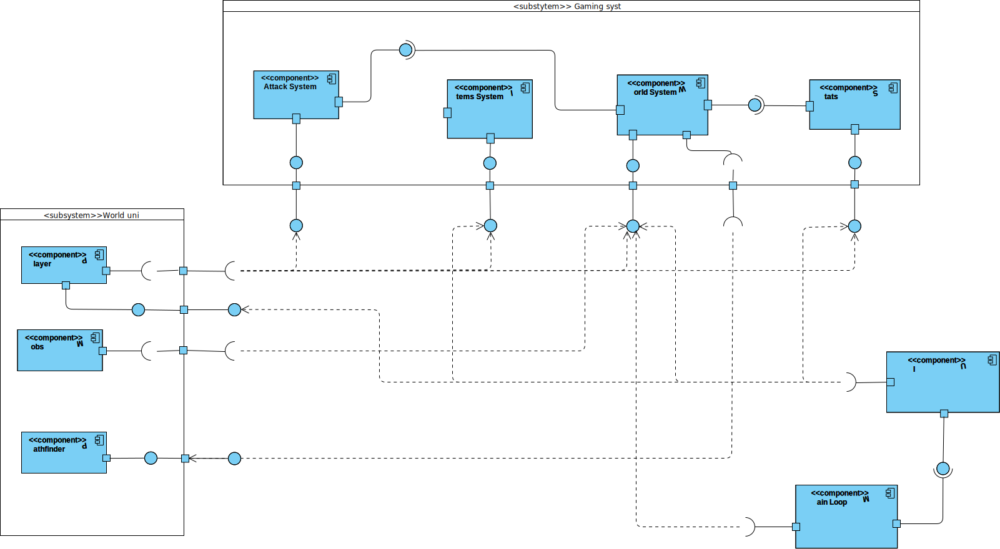
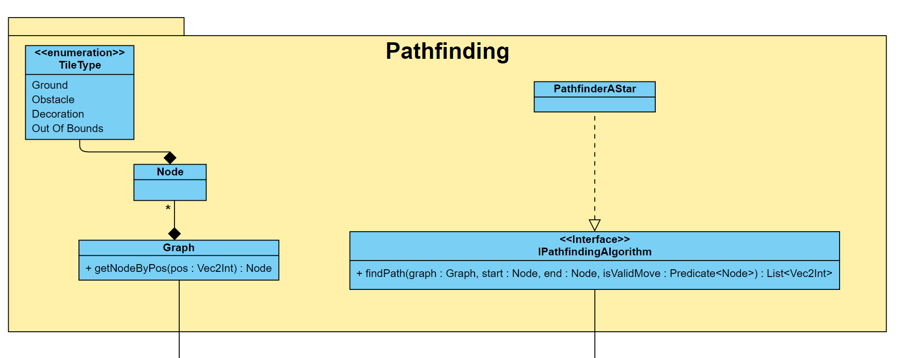

# Как запустить? 
В проекте используется библиотека cocos2d, которая уже встроена в репозиторий, и GoogleTests.
GoogleTests загружаются с помощью Cmake в папку проекта.
***
Для сборки необходимо скачать необходимые зависимости
#### Linux
```shell
    sudo apt-get install build-essential libgtk-3-dev
    sudo apt install libglew-dev
    sudo apt-get install curl
    sudo apt-get install libssl-dev libcurl4-openssl-dev
    sudo apt-get install libgl1-mesa-dev xorg-dev
```
#### Windows
```shell
  choco install ninja cmake
```

### Cборка

При сборке используется cmake и тип сборки Release:

#### Windows
```pws
  cmake -B ./build -AWin32 -DCMAKE_BUILD_TYPE=Release
  cmake --build ./build --config Release
```

#### Linux
```shell
  cmake -B ./build -DCMAKE_BUILD_TYPE=Release
  cmake --build ./build --config Release
```

Сам запуск:

```shell
    ./roguelike
```
### Тестирование
Находясь в корневой папке проекта, тесты можно запустить следующей командой:
```shell
tests/test_*`
```

# Архитектурная документация
***
## Служебная информация

**Название:** Undefined Behaviour\
**Авторы:** Арефьев Владислав, Асадуллин Илья, Самсонов Павел\
**Дата:** 14.06.2023

***

## 1. Общие сведения о системе
Система является однопользовательской пошаговой игрой с тайловой графикой
в жанре roguelike с видом сверху и генерацией мира.

#### Описание границ системы
+ Система является игрой
+ Жанр игры — roguelike
+ Игра является однопользовательской, пользователи не могут взаимодействовать друг с другом
+ Игра предназначена для десктопов
+ Игра является пошаговой, т.е. обновление игрового цикла происходит во время хода игрока
+ Взаимодействие с интерфейсом игры происходит исключительно с помощью клавиатуры и мыши
+ Внутриигровой мир двумерный
+ Игра использует тайловую графику
+ Система не использует звуковое сопровождение
+ Внутриигровая система не использует технологии искусственного интеллекта, 
вместо него используется генератор целых псевдослучайных чисел
+ Внутриигровые карты могут создаваться из любого тайлсета
+ Система при работе не использует подключение по сети

#### Описание контекста
+ Использует клавиатуру и мышь
+ Работает только на таких операционных системах, как Windows и Linux

#### Пользовательский интерфейс
+ Игрок и игровой мир выводятся в центре экрана.
+ В правой части экрана находится текущий статус игрока:
текущие здоровье (красная полоска), мана(синяя полоска), опыт(зеленая полоска) и уровень(число справа от опыта).
Под статусом находится инвентарь.
+ В нижней части экрана находятся текущие активные предметы: используемые заклинания, оружие и аксессуары.

#### Управление
+ Для передвижения используются стрелки на клавиатуре. Зеленые крестики рядом с персонажем показывают 
сторону, в которую смотрит игрок. Повторным нажатием на стрелку с тем же направлением происходит передвижение игрока на указанный тайл.
+ Взаимодействие с предметами, лежащими на земле происходит с помощью клавиши `E`:
  + Открытие сундука с оружием
  + Помещение оружий и расходников в инвентарь
+ Атака мобов и декораций происходит с помощью клавиши `Space`. Сначала игрок выбирает сторону, в которую он смотрит.
После этого вместо перемещения в выбранную сторону, можно нажать `Space` для нанесения урона на всех тайлах, которые помечены зелеными крестиками.
+ Выбор активного оружия из инвентаря выполняется с помощью левой клавиши мыши. Сначала выбирается нужное оружие в инвентаре,
после чего оно подсветится. Далее нужно нажать на слот активного оружия в нижней панели, после чего желаемое оружие станет активным.
Если до этого игрок уже имел активное оружие, то оно поместится в ячейку инвентаря, откуда было взято текущее активное оружие.
+ Использование расходников, находящихся в инвентаре, происходит по нажатию левой клавиши мыши по расходнику в инвентаре.
+ Выбросить любой предмет игрока можно с помощью нажатия правой клавиши мыши по этому предмету.

***
## 2. Architectural drivers

#### Технические ограничения
+ Операционные системы: Windows и Linux
#### Бизнес-ограничения
+ Разработка системы должна завершиться как можно раньше, а зачтена к 25.06.23;
+ Используемый бюджет должен составлять 0 рублей.

#### Качественные характеристики системы
+ Система должна предоставлять смену режима загрузки уровня: либо из файла, либо с помощью генератора;
+ Система должна предоставлять единый интерфейс данных, как для сгенерированного мира, так и для мира, который может создать пользовать вручную;
+ Система должна быть расширяемой, то есть архитектура приложения должна позволять легко создавать новых видов мобов, оружия и предметов без создания новых классов;
+ Система должна быть высокопроизводительной, чтобы каждый шаг игрового цикла занимал не более 0.5 секунды на компьютере с процессором Intel Core i3;
+ Объем используемой оперативной памяти игрой не должен превышать 1 Гб.

#### Ключевые функциональные требования
+ Система должна предоставлять графический пользовательский интерфейс для инвентаря и показаний характеристик игрока;
+ Игровая графика, тем самым и игровой мир, должен состоять из тайлов;
+ Персонаж игрока, должен перемещаться по карте соблюдая позицию относительно тайлов;
+ Персонаж должен иметь характеристики: здоровье, мана, уровень и очки опыта;
+ Игровой мир должен уметь генерироваться;
+ В игре должны присутствовать оружие и расходники, восполняющие здоровье;
+ Персонаж должен иметь инвентарь, в котором может храниться любой предмет в игре;
+ В игре должны присутствовать существа (мобы), с которыми игрок может вступать в бой;
+ При убийстве моба игрок должен получать очки опыта;
+ Перемещение и атака персонажа определяет шаг в игровом цикле;
+ Система должна оповещать о получении и наносимом уроне;
+ В игровом мире должны присутствовать элементы декора;
+ Система должна поддерживать управление с помощью клавиатуры и мыши.

#### Нефункциональные требования
+ Персонаж должен перемещаться с помощью стрелочек, атака производиться через пробел, а взаимодействие с предметами происходит с помощью клавиши E и мыши;
+ Оповещение об уроне должно быть реализовано в виде показа цифры урона, который будет нанесён в следующем шаге игрового цикла, по существу в данной клетке.

***
## 3. Роли и случаи использования

### Диаграма случаев использования


#### Роли:
+ Игрок
+ Кастомизатор — пользователь, который умеет создать карты

Ниже представлены случаи использования для каждой из ролей.
#### Случаи использования:
Игрок может: 
- начать игру — через запуск;
- перемещаться по карте — с помощью стрелок игрок перемещается на одну клетку в сторону нажатой клавиши;
- узнать текущую статистику, состоящую из очков здоровья, маны и опыта — она показывается в виде прогресс-баров в углу экрана;
- атаковать мобов для получения опыта и декораций для получения расходников;
- поднимать предметы из мира — вследствие чего они кладутся в инвентарь;
- перемещать предметы по инвентарю и использовать расходники;
- узнать способ атаки используемого оружия и моба.

Кастомизатор расширяет роль игрока и дополнительно может:
- создавать карту и редактировать имеющиеся — с помощью программы с открытым исходным кодом ["Tiled"](https://www.mapeditor.org/);
- изменять выпадаемый предмет из декораций и сундуков:
  - Для сундуков формат такой: <имя оружия>:<тир предмета>
  - Для декораций: <имя расходника>
- В качестве шаблона можно использовать файл `Template.tmx` в котором содержатся заранее заготовленные слои для объектов и тайлов;
- Доступые слои для объектов перечислены ниже:
  + `UtilObjects` — разные утилит объекты. Пока что единственным их представителем является точка появления игрока (`SpawnPoint`);
  + `Chest` — для сундуков;
  + `Decorations` — для декораций;
  + `PassiveMobs` — для пассивных мобов;
  + `BossMobs` — для боссов;
  + `EliteMobs` — для элитных врагов;
  + `NormalMobs` — для всех остальных мобов;
- Доступные слои для тайлов:
  + `Walls` — стены через которые нельзя ходить игроку и мобам с поведением не позволяющее ходить сквозь препятствие (`Obstacle`);
  + `Ground` — слой для рисования земли по которой будут ходить игрок и мобы.

- изменять мобов и настраивать их — кастомизатор выбирает тайл врага из заготовленного тайлсета, которые ограничены неизменяемым списком задающийся игрой.

### Описание типичного пользователя


__Богдан 32 года__, работает на заводе. \
Любит играть в roguelike игры и убивать мобов, 
тем самым снимая стресс повседневной жизни. 
Нравятся игры с большим разнообразием мобов разного уровня, а также наличие в них всевозможных видов оружий. 

 

__Витя 20 лет__, студент. \
Заядлый игрок и заодно ярый фанат roguelike. 
По своей натуре исследователь, любит изучать новые "фишки" в играх и исследовать каждый угол в мире.
Также любит собирать редкие предметы и раскрывать их полный потенциал. 


__Андрей 23 года__, программист, но в душе художник. \
Любит roguelike, а особенно те игры этого жанра, где можно тонко настраивать мир под свои предпочтения.
Очень нравится создавать интересные карты, которыми он с удовольствием делится со своими друзьями.
Однако, если игра у Андрея не идет, не прочь добавить в игру оружия по сильнее, а мобов сделать по слабее.

***
## 4. Композиция

### Диаграмма компонентов


Система состоит из данных компонент:
+ `Main Loop` — точка входа в программу, где выполняется главный игровой цикл. Он знает про игровой мир, так как его и создаёт.
Также создаёт UI, который затем уже работает обособленно общаясь с другими компонентами только через интерфейсы или обособленные классы;
+ `World System` — является компонентом, который инкапсулирует логику работы с картой и хранением всех сущностей в игре;
+ `Pathfinder` — внутри него находится только логика поиска пути;
+ `Stats` — является полностью отдельной компонентой, которой все пользуются только через интерфейсы. Она хранит информацию о характеристиках и позволяет их модифицировать;
+ `Player` — внутри него находится логика игрового персонажа и тех классов, которые не используются больше никем извне;
+ `Mobs` — система, которая прячет всё обновление мобов, а также конкретные фабрики мобов. То есть извне мы работаем только с `Mob` и абстрактной фабрикой;
+ `UI` — логика пользовательского интерфейса и о ней никто не знает (кроме `Main Loop`). Общается с внешним миром она только через прослойки в виде `ObservableVector` и других;
+ `Attack System` — находится вся логика о создании разных поведения атак и позволяет по статическим методам получить новое оружие;
+ `Items System` — компонент описывающей бизнес логику работу с предметами, коими являются оружия, аксессуары и расходники.

***
## 5. Логическая структура

### Диаграмма классов


### Точка входа и игровой цикл


У приложения есть точка входа вообще всей программы в виде класса `AppDelegate`,
который ловит обработчиков событий игрового движка.
Мы ловим обработчик `applicationDidiFinishLaunching` и создаём `GameScene`.
Также `AppDelegate` подписывается на событие `restarted`, который вызывается при нажатии кнопки `Restart` игроком.

`GameScene` является некой точкой входа для текущей игровой сессии.
Она создаёт игровой цикл (`GameLoop`), игровой мир (`World`) и UI (`Canvas`).
Также она подписывает игровой мир на обновление игрового цикла через паттерн `Observer`.
Помимо этого тут происходит создание игрока (`Player`), чтобы подписать обновление игрового цикла на передвижение игрока и его атаку.

### Игровой мир


Игровой мир (`World System`) занимается владением всех сущностей (`BaseEntity`),
которые находятся на карте, а также предоставляет доступ к конвертации в координаты карты.
Для его создания требуется, чтобы ему в конструктор передали `TilemapInfo`,
который хранит информацию о размерах карты, всех ее тайлах и объектах.

`TilemapInfo` можно создать через классы, которые являются реализацией паттерна `Builder`
Список строителей:
+ чтение из файла (`ReadFileWorldBuilder`);
+ сгенерировать по заданным параметрам (`RandomGeneratorWorldBuilder`). Он использует `WorldTileConfig`,
который является классом хранящим информацию об уровнях. Считывается через `json`, который хранится в ресурсах игры.
Если в генераторе заданы некорректные параметры, то генерации карты не происходит, возвращается нулевой указатель.

Сущность является базовым классом, который реализует контракт того,
что унаследованными сущностями владеет мир, а они используют мир для ориентации относительно координат игрового движка.

`DamageIndicatorSystems` — является классом для владения показываемых цифр урона на тайлах в мире.

Наследниками `BaseEntity` в данной компоненте являются `Decoration` и `Chest`:
+ Decoration — сущность с которой может выпадать расходник (`ConsumableItem`);
+ Chest — сущность с которой обязательно падает какой-то новый экземпляр оружия(`Weapon`).

Также есть реализация паттерна `Visitor`, чтобы облегчить доступ общения сущностей и разных систем,
ведь зачастую нужно понимать, что с какой конкретной реализацией сущности система работает:
+ `FunctionVisitorEntities<T>` — наследник, который использует функции для делегации вызовов `Visitor`'а
и эти функции имеют возвращаемый тип `T`, который можно получить после вызова `Visitor`'а в исполняемом коде;
+ `FunctionVisitorEntitiesReturnVoid` — такая же смысловая нагрузка, как и у `FunctionVisitorEntities<T>`,
но позволяет передавать функции, которые ничего не возвращают и проверить на то, была ли вызвана функция, через метод `isCalled`.

### Характеристики


Тот, кто может владеть характеристиками определяется интерфейсом `IHaveStats`,
который даёт доступ к контейнеру характеристик только через интерфейс `IStatsContainer`.

Интерфейс `IStat` предоставляет доступ к логике получению значения,
а также к его изменению на какое-то значение.
Также в нём есть событие `changed` сигнализирующее об изменении характеристики.

Плюс к этому есть система модификаторов, которые применяются к значению характеристики, валидируя его.

`LevelHandler` же является классом в котором спрятана логика изменения уровней сущностей
с учётом ограничений на заданное кол-во очков для каждого нового уровня.

### Игрок


Класс `Player` является игровым персонажем являющимся воплощением пользователя на игровой карте. \
У данного класса есть:
+ инвентарь (реализовано через список предметов `BaseItem` внутри игрока);
+ рюкзак (`Backpack`).

Также он предоставляет событие атаки, которое нужно для игровой сцены.

Вся делегация общения пользователя с его игровым персонажем заинкапсулирована через класс `PlayerInput`, который содержит события на:
+ нажатия клавиш движения;
+ нажатия кнопки атаки;
+ нажатия кнопки взаимодействия с предметами.

Также у персонажа можно менять его "часть тела" через перечисление `ClotheType`.

Рюкзак же хранит три экземпляра класса `HandlerItems` (который в свою очередь просто содержит коллекцию предметов) для слотов:
+ оружия (а также класс рюкзака позволяет получать сейчас одетое оружие для внешнего использования);
+ аксессуаров;
+ магии.

Также он наследует `IDamageModificator`, чтобы уметь с помощью аксессуаров модифицировать урон.

### Система предметов


Система предметов представляем собой совокупность трёх типов:
+ Оружия (`Weapon`) — которым игрок пользуется для нанесения урона врагам;
+ Аксессуаров (`Accessory`) — используются для изменения поведения атаки или характеристик игрока;
+ Расходников (`ConsumableItem`) — используется игроком для восстановления здоровья.

Предметы выпадают с разного рода сущностей игры в игровой мир, тем самым класс `BaseItem` является наследником `BaseEntity`,
чтобы мир смог знать и хранить их, предоставив тем самым доступ для подбора игроку данных предметов.

То есть предметом, когда игрок подбирает его (`pickUp`), начинает владеть не мир, а игрок с помощью инвентаря или рюкзака.
Также игрок может выбросить предмет (`throwOff`), тем самым предметом снова начинает владеть мир, а не игрок.

Также расходники переопределяют метод `interact`, который вызывается при нажатии на предмет в инвентаре игроком.

Оружие же создаётся через статический метод `CreateWeapon` у класса `Attacks` из другой системы.

### Система атаки


Главным классом в этой системе является `AttacksHandler`, который композирует `AttackWithDamage` с тем, на какие клетки он действует.

`AttackWithDamage` хранит:
+ `AttackInfo` — информация об атаке.
  + Которая в свою очередь хранит валидирующие классы:
    + `PossibleAttack` — функтор, который определяет по типу тайла, бьёт ли атака по данной клетке;
    + `PossibleAttackFromEntity` — функтор, который позволяет фильтровать по тому по какой сущности
ты бьёшь и проверять всякие условия. Например, что мобы умеет бить только игрока;
    + `AttackSearch` — проверяет, достижима ли атака.
Например, меч будет бить только в том случае, если нет препятствий на линии атаки, а какая-нибудь магия может позволять использовать себя через стены.
  + А также невалидирующие классы:
    + `VisualAttack` — визуальные эффекты, например показать анимацию удара и проиграть звук.
    + `Damage` — класс, который содержит цифру урона, а также хранит некий один модификатор (`IDamageModificator`),
который позволяет перед получением урона — модифицировать его. 

В `Attacks` же есть статический метод для создания `Weapon` и в нём заинкапсулирована логика создания паттернов атак.

### Поиск пути


Для работы поиска пути нужно на пользовательской стороне создать класс `Graph`, который состоит из узлов,
где главное, что в них хранится — это `TileType`.

`TileType` является идентификатором между позицией относительно карты и того, что в этой позиции находится:
+ `Ground` — земля, то есть то, что по чему могут ходить мобы;
+ `Obstacle` — препятствие, то есть по чему зачастую никто не может ходить. Например, это стены и сундуки;
+ `Decoration` — декорация для того, чтобы понимать, что игрок может бить по ним;
+ `Out Of Bounds` — обозначает, что кто-то пытался получить информации о позиции вне игровой карты.

Общение с алгоритмами поиска пути происходит через интерфейс `IPathfindingAlgprithm`. \
Его наследниками являются:
+ `PathfinderAStar` — является реализацией алгоритма [A*](https://www.redblobgames.com/pathfinding/a-star/implementation.html).

### Пользовательский интерфейс


Главным контейнером всего UI в игре является класс `Canvas`.
Он создаёт всё UI объекты, которые перечисляются следующим списком:
+ Объекта класса `StatBar` используется для показа здоровья, маны и очков опыта.
Данный класс инкапсулирует логику общения с интерфейсом `IStat`, который туда передается через конструктор;
+ `InventoryView` — инкапсулирует логику работы с `ObservableVector<T>` (который является не динамической коллекцией, 
в плане изменения размера, с событиями об изменении элементов и методами для создания этих изменений);
+ `MenuItemForInventory` — является классом, который обозначает ячейку в инвентаре.
То есть он хранит состояние в виде хранимого в нём предмета (или то, что там его нет);
+ `ItemTypeSlot` — перечисление, которое ограничивает возможность положить в другой `InventoryView` предмет того типа, который не допускает этого;
+ `PlayerItemsOnUI` — класс, который хранит ссылки на `InventoryView` и позволяет перемещать предметы
между инвентарями подписавшись на событие выделения предметов, которые предоставляют `InventoryView`.
По `SelectionItemType` данный класс понимает, что какого типа выделение было произведено.

***
## 6. Взаимодействия и состояния

### Диаграмма последовательностей цикла приложения
Данный цикл не меняется в зависимости от запуска и выбора загрузки уровня.


#### Диаграмма состояния мобов с агрессивным поведением
Данная диаграмма состояния представляет состояния моба, с агрессивным поведением и стратегией,
в которой если у моба хп опускается ниже заданного, он меняет свое поведение на трусливое.


После создания моб начинает с состоянием __Walking__, в данном состоянии моб перемещается по случайным соседним клеткам.

Если игрок заходит в область видимости, то моб переходит в состояние __Chase__,
при котором он начинает преследовать игрока по наикратчайшему пути.
Однако если пользователь каким-то образом опять пропадет из области видимости моба, то он перейдет в предыдущее состояние. 

Если пользователь зайдет в область атаки моба, то моб перейдет в состояние Attacking, в котором он будет производить атаку
каждый ход, до тех пор пока может это делать. При перемещении пользователя моб обратно перейдет в состояние __Chase__. 

Если у моба хп опускается ниже заданного порога, то он меняет свое состояние на __Run away__ и начнет убегать в 
противоположную сторону от игрока. Он убегает до тех пор, пока игрок не окажется вне зоны его видимости.

Стоит отметить, что каждое состояние обновляется только с ходом игрока и может сохраняться до тех пор, 
пока не будут выполнены условия перехода.

***
## 7. Почему были приняты те или иные решения

+ В качества движка нами был выбран [cocos2d-x](https://www.cocos.com/en/cocos2d-x) ([github](https://github.com/cocos2d/cocos2d-x)). Именно `cocos2d-x`, а не `Cocos Creator`.
  + потому что он из коробки поддерживал прочтение `tmx` формата, а также его рисование в игровом мире.
  А редакторов `tmx` форматов достаточно, тем самым мы смогли легко реализовать чтение мира из карты + позволили создавать карты кастомизаторам;
  + он знает об мировых координатах, так что нам не пришлось бы работать с `MVP` преобразованиями, которые за нас выполняет движок;
  + предоставлял стандартные шаблоны для `UI` и имел `Layout` систему для него же;
  + один из самых популярных 2d движков в открытом доступе без `UI` интерфейса самого движка (что было запрещено по заданию).
+ Мы отказались от реализации паттерна `Command`, чтобы связать `UI` и бизнес логику в пользу событий,
так как команду можно установить будет только одну, либо придётся городить декоратор команды и это усложнило бы общение.
А также из-за конкретного интерфейса `ICommand` не позволяло бы пользовательскому интерфейсу сообщать об изменении данных,
поэтому мы выбрали даже скорее направление реактивного программирования и создали `ObservableVector`,
предоставляющий методы на изменение и события, которые бы вызывались при изменении.
+ При генерации мы работаем с `MapInfo`, который предоставляет движок, а потом ещё раз читаем, что предоставил нам генератор.
  + Наверняка было бы быстрее сразу генерировать мир в генераторе, но тогда генератор резко узнает про мир, что усилит связность, что откровенно будет плохо;
  + Также такой способ открывает доступ к одинаковости работы, как с чтением из файла, так и генерации;
  + А ещё позволяет сразу сохранять в файл даже без визуальной генерации самого мира.
+ Сделали класс `Attacks` и `Items` "скрытыми" реализациями паттерна `Singleton`,
так как понимали, что создание новых атак или предметов через любой другой формат,
кроме кода — привело бы к тому, что мы бы потратили на это столько же времени сколько и на подобный прототип игры.

***
## 8. Что не добралось до релиза

Следующие перечисленные вещи не были реализованы из-за ~~выгорания главного геймдизайнера~~ недостатка времени:

+ Заклинания — для них нужны анимации, что очень трудозатратно
+ Аксессуары — нужно продумать характеристики
+ Выбор загрузки карты из файла или генерация со стороны игрока (без перекомпиляции проекта).
Также сейчас захардкожен один единственный уровень карты.
+ Репликация мобов по паттерну `Прототип`
